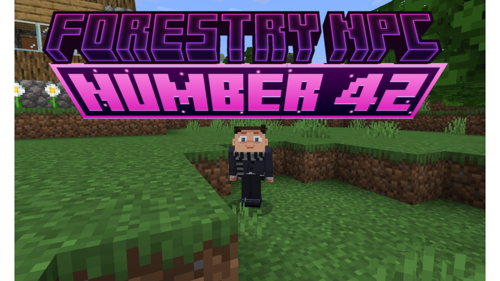

  
# Зміст
* [Опис](#опис)
* [Інструкція](#інструкція)
* [Завантажити](#завантажити) 
***
# Опис
**Лісництво NPC номер 42 (Forestry NPC number 42)** — це галузь лісового господарства, яка займається охороною, вирощуванням, раціональним використанням і відновленням лісів.  
**Лісове господарство** — це галузь економіки та науки, що займається вирощуванням, відновленням, охороною, використанням і раціональним управлінням лісами. Воно спрямоване на збереження екологічного балансу, забезпечення сталого використання лісових ресурсів і підтримку біорізноманіття.
# Інструкція
* Встановити `Minecraft Bedrock Edition (Patched)`
* Встановити `Forestry_NPC_number_42_v3.1.mcaddon`
* Встановити `Копія world.mctemplate`
* Встановити `Копія Дом для подписчиков от Компота.mctemplate` 
***
# Завантажити
> [!WARNING]
> Тільки для версії Minecraft Bedrock Edition (Patched) 1.21.60
> [Завантажити](https://github.com/uzvarUA/Forestry-NPC-number-42-mods-/releases) 
